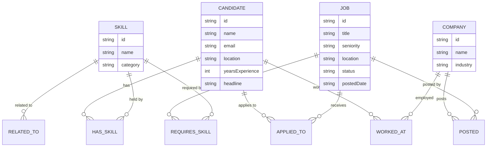
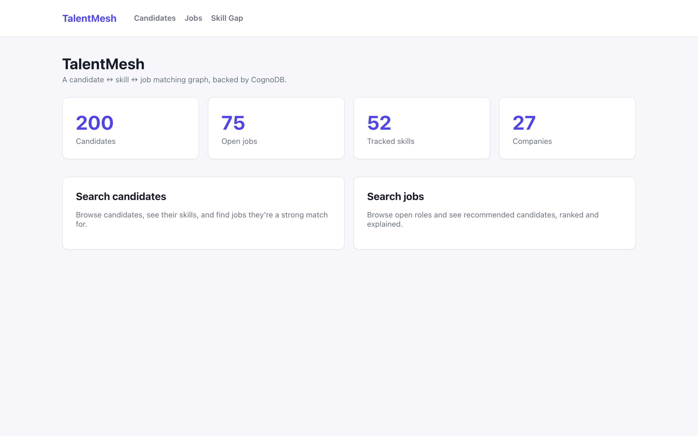
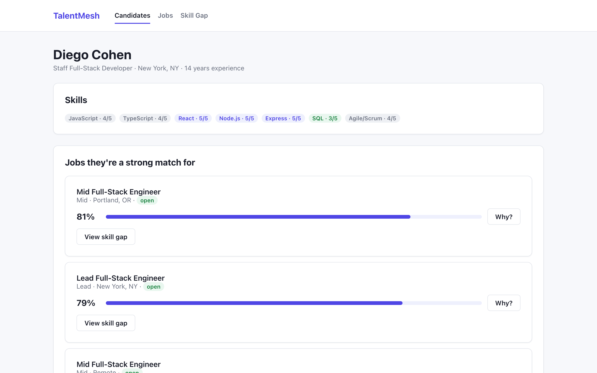
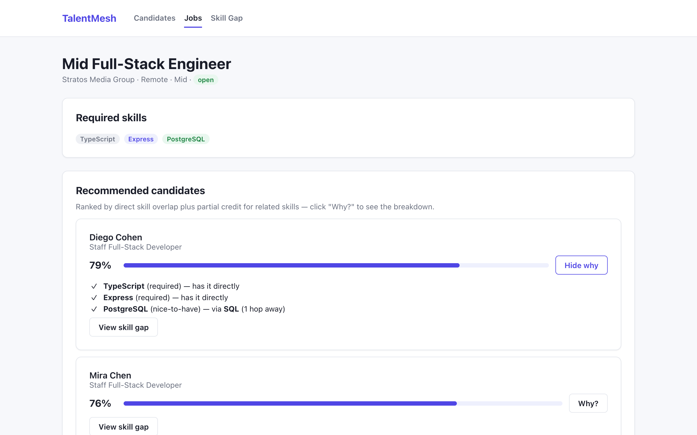
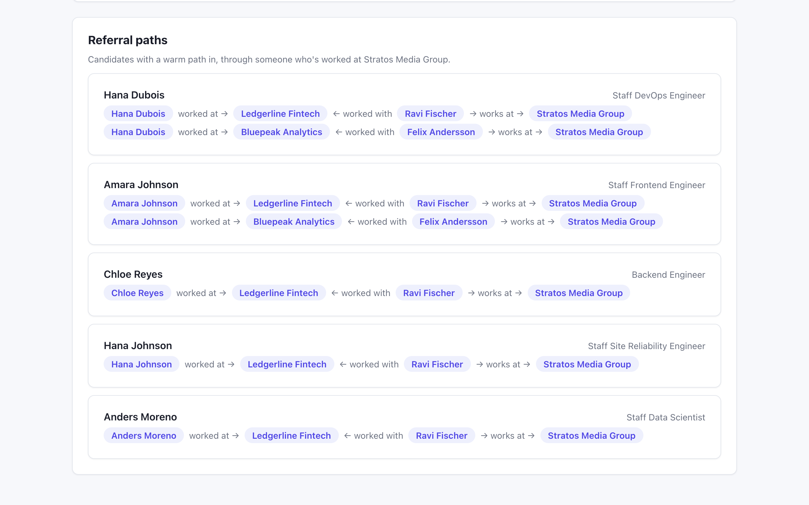
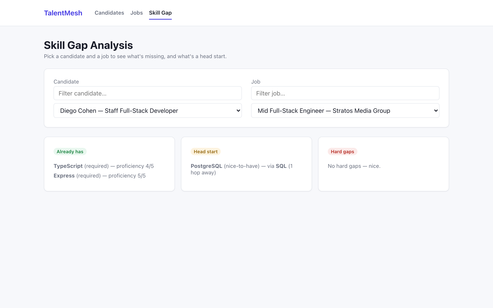
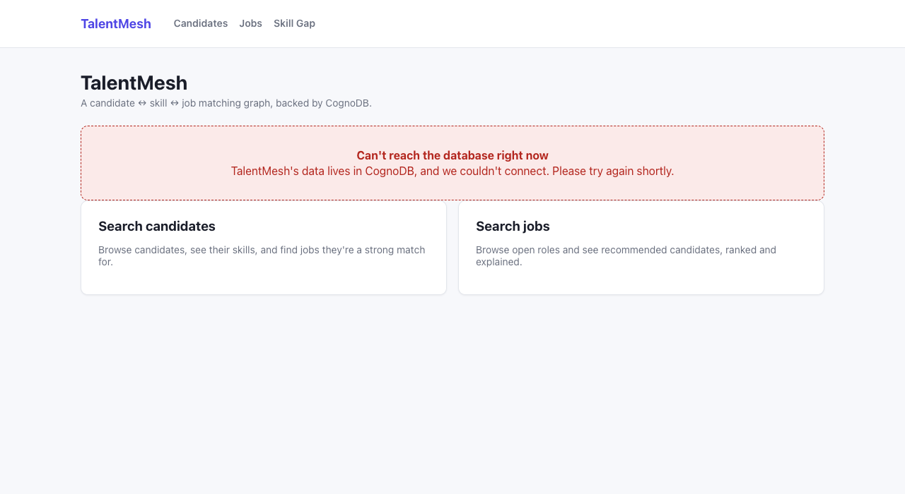

# TalentMesh

A candidate ↔ skill ↔ job matching graph for recruiting, built on **CognoDB** — because the
questions that actually matter in recruiting ("who fits, even loosely?", "who knows someone
here?", "how far off is this person, really?") are questions about relationships, not rows.

**Live demo:** https://abhilash7337.github.io/TalentMesh/ (backend may take 30-60s to wake up on
the first request — see [Demo](#demo))

## Use case

TalentMesh models a recruiting pool as a graph: candidates hold skills, jobs require skills,
companies post jobs, and candidates apply to jobs and have worked at companies. On top of that,
skills themselves are connected to each other by a `RELATED_TO` adjacency graph (React relates to
JavaScript, PostgreSQL relates to SQL, and so on). That last piece is what makes the whole thing
interesting: instead of only matching candidates who list the *exact* skill a job wants, TalentMesh
can find candidates whose skills are *close* to what's needed, explain referral paths through
shared work history, and score skill gaps by how far away a missing skill actually is in the graph.

## Why a graph database?

Three questions drive this app, and all three are naturally graph traversals and awkward relational joins:

1. **"Who fits this job, including people who don't list the exact skill but list something
   adjacent to it?"** — a 2-hop walk through a skill-similarity graph. In SQL this is a recursive
   CTE over a self-referencing edge table, joined back to a candidate-skills table, with path
   weights carried through each recursion level by hand.
2. **"Does this candidate have a warm path into this company through people they used to work
   with?"** — a 3-hop path (candidate → shared employer → colleague → target company). In SQL,
   three self-joins of a work-history table plus an anti-join to exclude direct hires.
3. **"What's the smallest skill gap between a candidate and a job, counting skills they could
   plausibly pick up because they're close to skills they already have?"** — the same weighted
   traversal as (1), reframed as a gap report.

None of these are impossible in SQL — they're just the kind of thing a graph engine expresses as
one pattern clause and a relational schema expresses as a page of recursive joins. TalentMesh's
flagship endpoint (`GET /jobs/:id/recommended-candidates`) is built around exactly this: it ranks
candidates by direct skill overlap *plus* partial credit for skills reachable within 1–2 hops via
`RELATED_TO`, weighted by hop distance and proficiency — see [Queries](#queries) below.

## Data model

4 node labels, 6 relationship types. Full property list and rationale in
[`docs/data-model.md`](docs/data-model.md).



| Relationship | Properties | Notes |
|---|---|---|
| `(Candidate)-[:HAS_SKILL]->(Skill)` | `proficiency` (1-5), `yearsUsed` | A candidate's claimed skill |
| `(Job)-[:REQUIRES_SKILL]->(Skill)` | `importance` (required/nice-to-have), `minYears` | What a job asks for |
| `(Company)-[:POSTED]->(Job)` | — | Ownership of a posting |
| `(Candidate)-[:APPLIED_TO]->(Job)` | `appliedDate`, `status` | Application history |
| `(Candidate)-[:WORKED_AT]->(Company)` | `role`, `startDate`, `endDate` | Work history — powers referral paths |
| `(Skill)-[:RELATED_TO]->(Skill)` | `strength` (0-1) | Skill adjacency, stored both directions |

The live graph currently holds **200 candidates · 75 jobs · 52 skills · 27 companies** and
**2,436 relationships**, generated by an archetype-based seed script (see below) so that job
requirements and candidate skill sets actually overlap in realistic ways.

## Setup

### 1. Create a CognoDB instance

1. Sign up at [console.cognodb.com/signup](https://console.cognodb.com/signup) — free tier, no
   credit card.
2. From the console, create a free **`c0`** instance and pick a region.
3. Copy the connection URI (`bolt+s://<instance-id>.databases.cognodb.cloud`) and the generated
   password for user `cognodb` — **the password is shown exactly once.**

### 2. Backend

```bash
cd backend
npm install
cp .env.example .env   # then fill in NEO4J_URI / NEO4J_USER / NEO4J_PASSWORD from step 1
npm run generate        # (re)generates seed JSON under seed/data/ — already included in the repo
npm run seed:reset      # loads it into CognoDB, wipes first; reports node/relationship counts
npm run dev              # starts the API on http://localhost:4000
```

### 3. Frontend

```bash
cd frontend
npm install
npm run dev              # starts on http://localhost:5173, talks to localhost:4000 by default
```

Set `VITE_API_URL` (see `frontend/.env.example`) if the backend runs somewhere other than
`localhost:4000`.

Both `backend/.env` and `frontend/.env` are gitignored — only `.env.example` placeholders are
committed. Never commit real credentials.

## Queries

Five queries exercise the graph in ways a relational schema would find awkward. Full Cypher, exact
return shapes, and the reasoning behind each are in [`docs/queries.md`](docs/queries.md) — summarized here:

1. **Recommended candidates** (`GET /jobs/:id/recommended-candidates`) — the flagship. Finds every
   skill within 0–2 `RELATED_TO` hops of each of a job's required skills, joins to candidates who
   hold any of them, and scores each candidate (hop-distance decay × proficiency × importance,
   summed and expressed as a 0-100 `matchPercent`) with a full per-skill breakdown — so the UI can
   show *why* someone matched, not just a number.
2. **Skill-gap analysis** (`GET /candidates/:id/skill-gap/:jobId`) — the same traversal, reframed:
   for a candidate's missing skills, is there something they already know within 1–2 hops that
   gives them a head start?
3. **Referral paths** (`GET /jobs/:id/referral-paths`) — a 3-hop path (candidate → shared former
   employer → colleague → the hiring company), surfacing warm ways in.
4. **Trending skills** (`GET /skills/trending`) — 2-hop co-occurrence through a shared candidate:
   "people with X often also have Y," globally or for one named skill.
5. **Candidate/job detail** — 1-hop joins (candidate-with-skills, job-with-company-and-required-skills).

Every query is parameterized through the driver's parameter map — no string-built Cypher anywhere
in the codebase (verified by grep across every service file).

**A finding worth knowing about:** while building these queries, live testing against the CognoDB
instance (not just reading the code) surfaced a real engine quirk — pattern-predicates used as
booleans (`NOT (a)-[:REL]->(b)`) and property filters on the far node of `OPTIONAL MATCH` aren't
scoped to the specific bound nodes here, and silently return wrong (not erroring) results. Full
writeup, and the workaround used, in `docs/queries.md`.

## Screenshots

**Dashboard**


**Candidate detail — skills and recommended jobs**


**Job detail — recommended candidates, match score explained**


**Referral paths**


**Skill-gap analysis**


**Error state — CognoDB unreachable**


## Demo

**Live app:** https://abhilash7337.github.io/TalentMesh/
**Backend API:** https://talentmesh-backend.onrender.com

Frontend is deployed on GitHub Pages, backend on Render's free tier, both pointed at the same live
CognoDB instance. The free Render instance spins down after 15 minutes idle — the first request
after a while can take 30-60 seconds to wake it back up.

<!-- TODO: screen recording link, once recorded. -->
