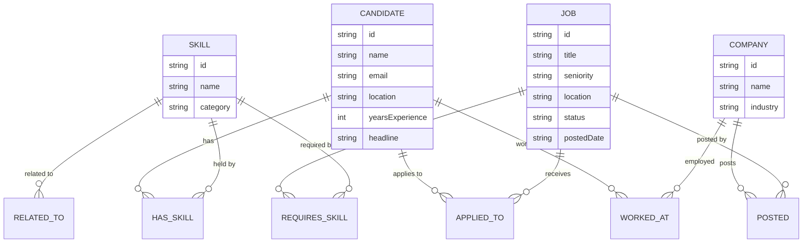

# TalentMesh — Graph Data Model

## Nodes

| Label | Properties | Notes |
|---|---|---|
| `Candidate` | `id` (string, unique), `name`, `email`, `location`, `yearsExperience` (int), `headline` | A job seeker. |
| `Skill` | `id` (string, unique), `name`, `category` | e.g. category = "language", "framework", "cloud", "database", "soft-skill". |
| `Job` | `id` (string, unique), `title`, `seniority`, `location`, `status` ("open"/"closed"), `postedDate` (date string, ISO) | A job opening posted by a `Company`. |
| `Company` | `id` (string, unique), `name`, `industry` | Employer. |

## Relationships

| Relationship | Properties | Direction | Notes |
|---|---|---|---|
| `(:Candidate)-[:HAS_SKILL]->(:Skill)` | `proficiency` (int, 1-5), `yearsUsed` (int) | Candidate → Skill | A candidate's claimed skill and how strong it is. |
| `(:Job)-[:REQUIRES_SKILL]->(:Skill)` | `importance` ("required"/"nice-to-have"), `minYears` (int) | Job → Skill | What a job asks for. |
| `(:Company)-[:POSTED]->(:Job)` | — | Company → Job | Ownership of a job posting. |
| `(:Candidate)-[:APPLIED_TO]->(:Job)` | `appliedDate` (date string), `status` ("applied"/"interviewing"/"rejected"/"hired") | Candidate → Job | Application history. |
| `(:Candidate)-[:WORKED_AT]->(:Company)` | `role`, `startDate`, `endDate` (nullable — null means current) | Candidate → Company | Work history, used for referral-path queries. |
| `(:Skill)-[:RELATED_TO]->(:Skill)` | `strength` (float, 0-1) | Skill → Skill, created both directions so traversal is direction-agnostic | Skill-adjacency graph, e.g. React–JavaScript–TypeScript–Node.js. |

## Constraints (uniqueness, enforced at load time)

- `Candidate.id`, `Skill.id`, `Job.id`, `Company.id` are each unique.

## Mermaid ER diagram

## Why a graph database?

TalentMesh's core questions are about relationships, not rows: finding candidates whose skills are
adjacent (not identical) to a job's requirements via a skill-similarity graph, finding warm-referral
paths through shared work history, and scoring skill gaps by graph distance. These require
multi-hop, variable-length traversals that are natural in Cypher and awkward as recursive SQL joins.
See the README's "Why a graph database?" section for the polished version.
